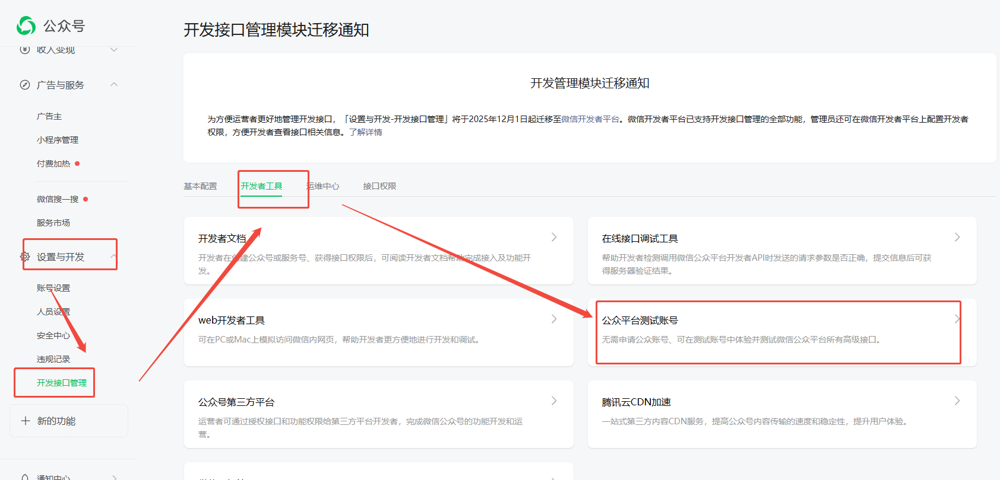
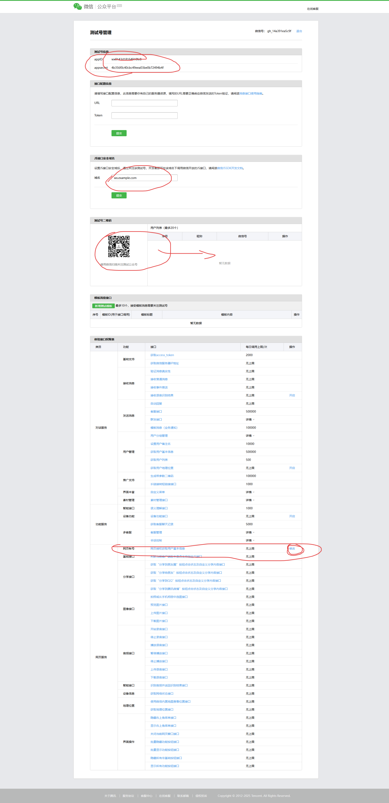
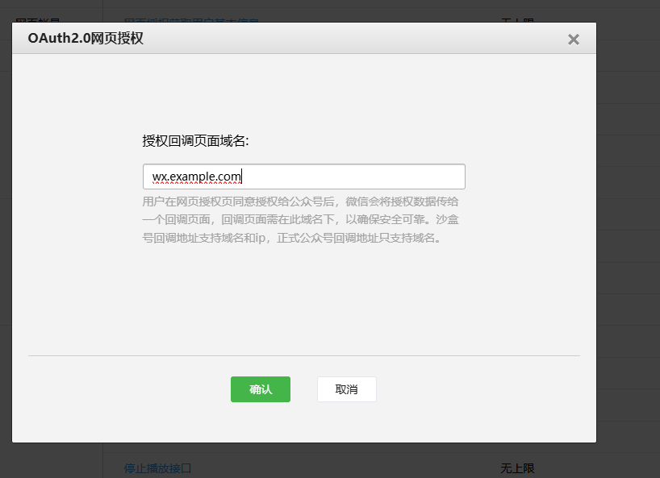
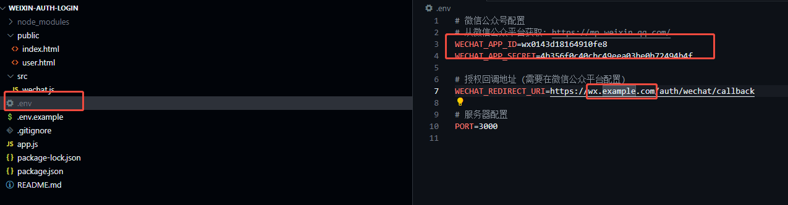

# 微信授权登录 - Node.js 实现

基于 Node.js 和 Express 实现的微信公众号网页授权登录功能。

源码地址：https://github.com/dao-projects/weixin-auth-login.git

## 功能特点

- ✅ 完整的 OAuth 2.0 授权流程
- ✅ 获取微信用户基本信息
- ✅ Token 刷新机制
- ✅ CSRF 攻击防护
- ✅ Session 持久化
- ✅ 响应式前端页面

## 目录结构

```
weixin-auth-login/
├── app.js              # Express 服务器主文件
├── src/
│   └── wechat.js       # 微信授权核心逻辑
├── public/
│   ├── index.html      # 登录页面
│   └── user.html       # 用户信息页面
├── .env.example        # 环境变量示例
├── package.json
└── README.md
```

## 快速开始

### 1. 安装依赖

```bash
npm install
```

### 2. 配置环境变量

复制 `.env.example` 为 `.env` 并填写配置：

```bash
cp .env.example .env
```

编辑 `.env` 文件：

```env
# 微信公众号配置
WECHAT_APP_ID=你的AppID
WECHAT_APP_SECRET=你的AppSecret

# 授权回调地址
WECHAT_REDIRECT_URI=http://你的域名/auth/wechat/callback

# 服务器配置
PORT=3000
```

### 3. 启动服务

```bash
npm start
```

服务启动后访问 http://localhost:3000

## 微信公众平台配置

### 获取 AppID 和 AppSecret

1. 登录 [微信公众平台](https://mp.weixin.qq.com/)
2. 进入「开发」->「基本配置」
3. 获取 AppID 和 AppSecret

* 开发可使用（公众号测试账号）：
  
  - 设置与开发-> 开发接口管理->开发者工具->公众号平台测试账号
 
  - 公众号测试号：[微信公众平台](https://mp.weixin.qq.com/debug/cgi-bin/sandbox?t=sandbox/login) -> 注意配置： 网页服务 - >网页帐号(修改)







### 配置授权回调域名

1. 进入「设置与开发」->「公众号设置」->「功能设置」
2. 配置「网页授权域名」（不需要带 http:// 前缀）

> ⚠️ 注意：回调域名必须是已备案的域名，不支持 IP 地址和 localhost

## API 接口

### 发起授权登录

```
GET /auth/wechat
```

参数：
- `scope`: 授权范围，可选 `snsapi_base`（静默授权）或 `snsapi_userinfo`（获取用户信息），默认 `snsapi_userinfo`

### 授权回调

```
GET /auth/wechat/callback
```

微信授权后自动回调此接口。

### 获取用户信息

```
GET /api/user
```

返回示例：

```json
{
  "success": true,
  "data": {
    "openid": "o6_xxx",
    "nickname": "微信昵称",
    "sex": 1,
    "province": "广东",
    "city": "深圳",
    "country": "中国",
    "headimgurl": "头像URL",
    "unionid": "unionid（如已绑定开放平台）"
  }
}
```

### 刷新 Token

```
POST /api/refresh-token
```

### 退出登录

```
GET /logout
```

## 授权流程说明

```
┌──────────┐     ┌──────────┐     ┌──────────┐     ┌──────────┐
│   用户   │     │  服务器   │     │   微信   │     │  服务器   │
└────┬─────┘     └────┬─────┘     └────┬─────┘     └────┬─────┘
     │                │                │                │
     │ 1.点击登录      │                │                │
     │───────────────►│                │                │
     │                │                │                │
     │ 2.重定向到微信  │                │                │
     │◄───────────────│                │                │
     │                │                │                │
     │ 3.用户授权      │                │                │
     │───────────────────────────────►│                │
     │                │                │                │
     │ 4.回调(带code) │                │                │
     │◄──────────────────────────────│                │
     │                │                │                │
     │ 5.code换token  │                │                │
     │                │───────────────────────────────►│
     │                │                │                │
     │                │ 6.返回token    │                │
     │                │◄───────────────────────────────│
     │                │                │                │
     │                │ 7.获取用户信息  │                │
     │                │───────────────────────────────►│
     │                │                │                │
     │ 8.登录成功     │                │                │
     │◄───────────────│                │                │
     │                │                │                │
```

## 开发调试

### 使用内网穿透工具

由于微信授权需要配置域名，本地开发时可使用内网穿透工具：

- [ngrok](https://ngrok.com/)
- [natapp](https://natapp.cn/)
- [花生壳](https://hsk.oray.com/)

### 微信开发者工具

可使用 [微信开发者工具](https://developers.weixin.qq.com/miniprogram/dev/devtools/download.html) 调试公众号网页。

## 注意事项

1. **域名要求**：回调域名必须是已备案域名
2. **HTTPS**：生产环境建议使用 HTTPS
3. **Token 有效期**：access_token 有效期为 2 小时，refresh_token 有效期为 30 天
4. **用户信息**：`snsapi_base` 只能获取 openid，`snsapi_userinfo` 才能获取完整用户信息
5. **UnionID**：只有在公众号绑定到微信开放平台后才能获取 unionid

## License

MIT
